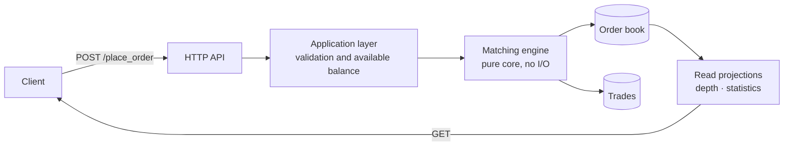
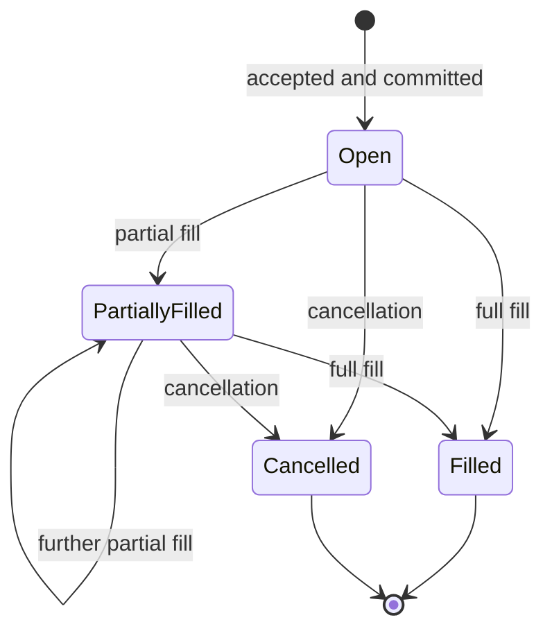

**English** · [Português](README.pt-BR.md)

# Trading Platform

A digital asset trading platform with an order book and a custom matching engine. Accounts,
balance custody, limit orders, price based order matching, aggregated market depth and trade
history.

**Stack:** TypeScript · Node 24 · Express 5 · PostgreSQL 18 · Vitest · Docker

---

## Overview

Users hold accounts with balances across multiple assets and trade market pairs such as
`BTC-USD` through buy and sell orders. Every order enters the order book, where the matching
engine immediately attempts to execute it against the opposite side. With no counterpart
available, the order rests in the book and waits.



The matching engine is deliberately a pure function over book state: it knows nothing about
the database, HTTP or transport. Persistence and delivery live at the edges, behind
interfaces. This keeps the densest business rule in the system testable without any
infrastructure.

---

## Domain

The code speaks the language of the market, with no translation layer in between.

| Term | Meaning |
|---|---|
| **Market** | A tradable pair, `BASE-QUOTE` (e.g. `BTC-USD`). Base is the traded asset; quote is the payment asset. |
| **Order** | An instruction to buy or sell at a limit price. Executes only if the price is met. |
| **Order Book** | Open orders organised by price on two sides. |
| **Maker** | An order already resting in the book. Provides liquidity. |
| **Taker** | An incoming order that consumes liquidity from the book. |
| **Trade** | The result of a match between a buy and a sell order. |
| **Fill** | Execution of an order, whether full or partial. |
| **Depth** | Liquidity aggregated by price band on both sides of the book. |
| **Spread** | Distance between the best bid and the best ask. |

### Matching rule

A match always happens between the **highest bid** and the **lowest ask**. When the prices
cross, the orders execute. The outcome follows two principles:

> **The trade price is the maker's price. The trade side is the taker's side.**

The executed quantity is the smaller of the two orders, and the larger order stays in the book
with its remaining amount. Because the price comes from the resting order, the taker may get
better terms than requested, expected exchange behaviour known as *price improvement*.

**Example.** The book holds a buy of 10 BTC at 83,000. A sell of 5 BTC at 82,400 arrives. The
prices cross, so 5 BTC execute at **83,000** (the maker's price) on the **sell** side (the
taker's side). The sell order is filled and leaves the book, while the buy order remains with
5 BTC.

### Order lifecycle



---

## Architecture decisions

### Available balance is derived, not stored

An account may hold 10 BTC in custody and still be unable to sell 10 BTC, because part of it
is already committed to open orders. The balance that matters during validation is the
**available** one:

```
available = custody - committed to open orders
```

The alternative would be a `reserved` column updated on every order transition. Deriving it
instead removes an entire class of bugs where the reservation drifts away from reality because
some code path forgot to decrement it. The cost is an aggregation over open orders on the
validation path, acceptable while the per account book stays small and replaceable by a
materialised projection if the load profile changes.

A **buy** order commits the quote asset (`quantity × price` in USD), while a **sell** order
commits the base asset (`quantity` in BTC).

### Concurrency: partition instead of lock

The critical point of the system is that two simultaneous orders from the same account can
both pass balance validation and commit the same asset twice. Pessimistic locks on the balance
do solve it, but they turn the hottest path in the system into a serialised bottleneck,
exactly the opposite of what a trading platform needs.

The chosen direction is a **single writer per market**: orders for the same pair are queued
and processed in sequence by one exclusive consumer. With no concurrency inside the partition
there is no need for locks, and ordering, which in an order book is part of the business rule
rather than an implementation detail, becomes a guarantee of the broker. Parallelism comes
from the number of markets, not from threads competing over the same state.

The trade-off is explicit: matching is no longer synchronous. The API answers *order accepted*
rather than *order executed*, and the execution result arrives as an event. In exchange, the
critical path is free of contention and behaviour becomes deterministic and reproducible,
since the same order log always yields the same book.

### Reads separated from writes

`depth`, `trades` and market statistics have requirements opposite to those of writes: they
tolerate minimal staleness and need to be fast and aggregated. They are treated as read
projections fed by execution events, rather than as aggregate queries run against the orders
table on every request.

---

## API

| Method | Route | Description |
|---|---|---|
| `POST` | `/signup` | Creates an account. Validates full name, unique email, document and password strength. |
| `POST` | `/deposit` | Credits an asset to the account. |
| `POST` | `/withdraw` | Debits an asset, bounded by the available balance. |
| `POST` | `/place_order` | Registers a limit order and triggers an execution attempt. |
| `POST` | `/cancel_order` | Cancels an open order and releases the committed balance. |
| `GET` | `/accounts/:accountId` | Account and positions. |
| `GET` | `/accounts/:accountId/orders` | Account orders, filterable by status. |
| `GET` | `/orders/:orderId` | A single order. |
| `GET` | `/markets/:marketId` | Spread, low, high and volume over a period. |
| `GET` | `/markets/:marketId/trades` | Market trades. |
| `GET` | `/markets/:marketId/depth` | Book aggregated by price band. |

The `precision` parameter on `/depth` sets aggregation granularity by order of magnitude. With
`precision=3`, orders are grouped into bands of 1,000 and their quantities summed, so orders
at 84,500, 84,600 and 84,700 collapse into a single band at 84,000.

---

## Data model

PostgreSQL, schema `app`:

- **account**: identity and credentials (`account_id`, `name`, `email`, `document`, `password`)
- **balance**: custody per account and asset, composite key (`account_id`, `asset_id`, `quantity`)
- **order**: book orders, carrying executed quantity, executed price and status
- **trade**: executions, referencing the matched buy and sell orders

Quantities and prices use `numeric`, never floating point.

---

## Running

Requirements: Node 22.6+ (version pinned in `.nvmrc`) and Docker.

```bash
npm install
npm run compose:up
```

PostgreSQL starts on port 5432 and applies `database/create.sql` on first boot.

```bash
npx vitest run          # full suite, single run
npm test                # watch mode
npm run test:coverage
npm run compose:down    # tear down container and volume
```

---

## Tests

```
test/unit/          pure domain rules: validation, matching, aggregation. No I/O.
test/integration/   end to end flows against a real PostgreSQL container.
```

The split follows the nature of the rule, not the folder structure of the code. Anything
deterministic and free of external dependencies, such as document validation, order crossing
and depth and spread calculation, is covered by unit tests that run in milliseconds. Anything
crossing an I/O boundary is covered by integration tests against a real database, because
mocking the database hides precisely the failures that matter: schema, transactions and
concurrency.

---

## Roadmap

- [x] Project setup: containerised database, schema and test harness
- [ ] Accounts: signup with name, email, document and password validation
- [ ] Custody: deposit, withdrawal and position lookup
- [ ] Orders: registration with available balance validation
- [ ] Matching engine: full and partial execution, trade generation
- [ ] Cancellation and release of committed balance
- [ ] Read projections: depth, trades and market statistics
- [ ] Partitioned processing per market
- [ ] Order book web interface
