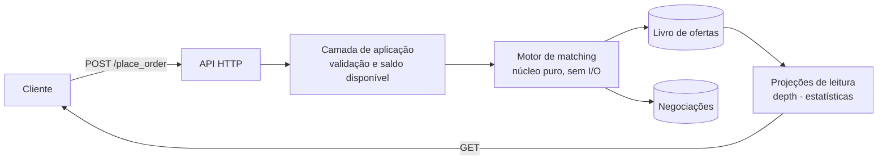
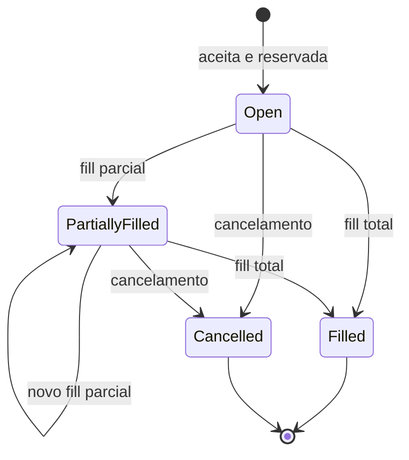

[English](README.md) · **Português**

# Trading Platform

Plataforma de negociação de ativos digitais com livro de ofertas e motor de matching próprio.
Contas, custódia de saldos, ordens limitadas, execução por correspondência de preço,
profundidade de mercado agregada e histórico de negociações.

**Stack:** TypeScript · Node 24 · Express 5 · PostgreSQL 18 · Vitest · Docker

---

## Objetivo

Este projeto é uma implementação prática de fundamentos de arquitetura de software. O domínio
foi escolhido pelo que concentra num escopo pequeno: regra de negócio densa e determinística,
concorrência disputando o mesmo estado, exigência de consistência sob carga e um caminho de
leitura com requisitos opostos aos da escrita.

A ênfase está nas fronteiras. A regra de negócio permanece independente de infraestrutura e
testável sem ela, as decisões são registradas com o trade-off e não apenas com a conclusão, e
cada escolha estrutural responde a um problema que o domínio de fato impõe.

---

## Visão geral

Usuários mantêm contas com saldos em múltiplos ativos e negociam pares de mercado
(ex.: `BTC-USD`) através de ordens de compra e venda. Toda ordem entra no livro de ofertas e o
motor de matching tenta executá-la imediatamente contra o lado oposto. Sem correspondência, a
ordem permanece no livro aguardando contraparte.



O motor de matching é deliberadamente uma função pura sobre o estado do livro: não conhece
banco, HTTP nem transporte. Persistência e entrega ficam nas bordas, atrás de interfaces. Isso
mantém a regra de negócio mais densa do sistema testável sem infraestrutura.

---

## Domínio

A linguagem do código é a linguagem do mercado, sem camada de tradução.

| Termo | Significado |
|---|---|
| **Market** | Par negociável, `BASE-QUOTE` (ex.: `BTC-USD`). Base é o ativo negociado; quote é o meio de pagamento. |
| **Order** | Instrução de compra ou venda a preço limite. Só executa se o preço for atingido. |
| **Order Book** | Ordens abertas organizadas por preço, em dois lados. |
| **Maker** | Ordem que já estava no livro. Fornece liquidez. |
| **Taker** | Ordem que chega e consome liquidez do livro. |
| **Trade** | Resultado de uma correspondência entre uma compra e uma venda. |
| **Fill** | Execução, total ou parcial, de uma ordem. |
| **Depth** | Liquidez agregada por faixa de preço nos dois lados do livro. |
| **Spread** | Distância entre a melhor oferta de compra e a melhor de venda. |

### Regra de execução

A correspondência ocorre sempre entre a **maior oferta de compra** e a **menor oferta de
venda**. Havendo cruzamento de preços, executa. O resultado segue dois princípios:

> **O preço do trade é o preço do maker. O lado do trade é o lado do taker.**

A quantidade executada é a menor entre as duas ordens, e a ordem maior permanece no livro com
o saldo remanescente. Como o preço vem de quem já estava no livro, o taker pode receber
condição melhor do que pediu, comportamento esperado de bolsa conhecido como
*price improvement*.

**Exemplo.** O livro tem uma compra de 10 BTC a 83.000. Chega uma venda de 5 BTC a 82.400.
Os preços cruzam, então executa 5 BTC a **83.000** (preço do maker), lado **venda** (lado do
taker). A ordem de venda é liquidada e sai do livro, e a de compra segue com 5 BTC.

### Ciclo de vida da ordem



---

## Decisões de arquitetura

### Saldo disponível é derivado, não armazenado

Uma conta pode ter 10 BTC em custódia e ainda assim não poder vender 10 BTC, porque parte já
está comprometida em ordens abertas. O saldo que importa na validação é o **disponível**:

```
disponível = custódia - comprometido em ordens abertas
```

A alternativa seria manter uma coluna `reserved` atualizada a cada transição de ordem. Optei
por derivar, o que elimina a classe inteira de bugs em que a reserva diverge da realidade por
um caminho de código que esqueceu de decrementar. O custo é uma agregação sobre ordens
abertas na validação, aceitável enquanto o livro por conta for pequeno e substituível por uma
projeção materializada se o perfil de carga mudar.

Uma ordem de **compra** compromete o ativo de cotação (`quantidade × preço` em USD), e uma de
**venda** compromete o ativo base (`quantidade` em BTC).

### Concorrência: particionar em vez de travar

O ponto crítico do sistema é que duas ordens simultâneas da mesma conta podem passar na
validação de saldo e comprometer o mesmo ativo duas vezes. Locks pessimistas sobre o saldo
resolvem, mas transformam o caminho mais quente do sistema num gargalo serializado,
justamente o oposto do que uma plataforma de trading precisa.

A direção adotada é **um único escritor por mercado**: ordens de um mesmo par são enfileiradas
e processadas em sequência por um consumidor exclusivo. Sem concorrência dentro da partição
não há necessidade de lock, e a ordenação, que num livro de ofertas é parte da regra de
negócio e não detalhe de implementação, passa a ser garantida pelo broker. O paralelismo vem
da quantidade de mercados, e não de threads disputando o mesmo estado.

O trade-off é explícito: o matching deixa de ser síncrono. A API responde *ordem aceita*, e
não *ordem executada*, com o resultado da execução chegando por evento. Em troca, o caminho
crítico fica livre de contenção e o comportamento vira determinístico e reproduzível, já que o
mesmo log de ordens produz sempre o mesmo livro.

### Leitura separada da escrita

`depth`, `trades` e as estatísticas de mercado têm requisitos opostos aos da escrita: toleram
uma defasagem mínima e precisam ser rápidos e agregados. São tratados como projeções de
leitura alimentadas pelos eventos de execução, e não como consultas agregadas sobre a tabela
de ordens a cada requisição.

---

## API

| Método | Rota | Descrição |
|---|---|---|
| `POST` | `/signup` | Cria conta. Valida nome completo, e-mail único, CPF e força da senha. |
| `POST` | `/deposit` | Credita ativo na conta. |
| `POST` | `/withdraw` | Debita ativo, limitado ao saldo disponível. |
| `POST` | `/place_order` | Registra ordem limitada e dispara tentativa de execução. |
| `POST` | `/cancel_order` | Cancela ordem aberta e libera o saldo comprometido. |
| `GET` | `/accounts/:accountId` | Conta e posições. |
| `GET` | `/accounts/:accountId/orders` | Ordens da conta, filtráveis por status. |
| `GET` | `/orders/:orderId` | Ordem individual. |
| `GET` | `/markets/:marketId` | Spread, mínima, máxima e volume no período. |
| `GET` | `/markets/:marketId/trades` | Negociações do mercado. |
| `GET` | `/markets/:marketId/depth` | Livro agregado por faixa de preço. |

O parâmetro `precision` de `/depth` define a granularidade da agregação por ordem de grandeza.
Com `precision=3`, as ordens são agrupadas em faixas de 1.000 e as quantidades somadas, de
modo que ordens a 84.500, 84.600 e 84.700 aparecem como uma única faixa em 84.000.

---

## Modelo de dados

PostgreSQL, schema `app`:

- **account**: identidade e credenciais (`account_id`, `name`, `email`, `document`, `password`)
- **balance**: custódia por conta e ativo, chave composta (`account_id`, `asset_id`, `quantity`)
- **order**: ordens do livro, com quantidade e preço executados e status
- **trade**: negociações, referenciando as ordens de compra e venda correspondidas

Quantidades e preços usam `numeric`, nunca ponto flutuante.

---

## Executando

Requisitos: Node 22.6+ (versão fixada em `.nvmrc`) e Docker.

```bash
npm install
npm run compose:up
```

O Postgres sobe na porta 5432 e aplica `database/create.sql` na primeira inicialização.

```bash
npx vitest run          # suíte completa, execução única
npm test                # watch mode
npm run test:coverage
npm run compose:down    # derruba o container e o volume
```

---

## Testes

```
test/unit/          regra de domínio pura: validações, matching, agregação. Sem I/O.
test/integration/   fluxos ponta a ponta contra PostgreSQL real, em container.
```

A separação segue a natureza da regra, e não a estrutura de pastas do código. O que é
determinístico e sem dependência externa, como validação de documento, cruzamento de ordens e
cálculo de profundidade e spread, é coberto por testes unitários que rodam em milissegundos.
O que atravessa fronteira de I/O é coberto por integração com banco real, porque *mock* de
banco esconde exatamente as falhas que importam: schema, transação e concorrência.

---

## Roadmap

- [x] Setup do projeto: banco containerizado, schema e infraestrutura de testes
- [ ] Contas: cadastro com validação de nome, e-mail, CPF e senha
- [ ] Custódia: depósito, saque e consulta de posições
- [ ] Ordens: registro com validação de saldo disponível
- [ ] Motor de matching: execução total e parcial, geração de negociações
- [ ] Cancelamento e liberação de saldo comprometido
- [ ] Projeções de leitura: depth, trades e estatísticas de mercado
- [ ] Processamento particionado por mercado
- [ ] Interface web do livro de ofertas
